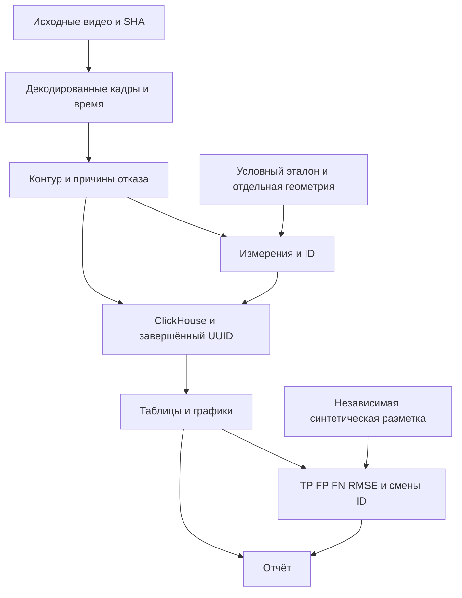

# Реестр утверждений 01.10.2026

| ID | Утверждение | Основание | Граница |
|---|---|---|---|
| C1 | Радиальная подгонка с soft_l1 и явными отказами реализована | cv_geometry.py, тесты, quality.json | Математический контур, не физическая погрешность |
| C2 | Сопровождение использует время и выдерживает неравномерный шаг | CircleTracker; test_irregular_timestamps_and_gap | Выбранный сценарий, пересечение может менять ID |
| C3 | Диагностика и измерения хранятся в ClickHouse | python_quality_v1; реальный интеграционный тест; UUID запусков | Локальный сервер; промышленное развёртывание не проверено |
| C4 | Новый тестовый набор завершился успешно | tests.log:29 OK,6 ClickHouse | Это тесты компонентов и выбранных видео |
| C5 | Масштаб около3.98мм предварительный | Прямое сообщение исполнителя; calibration.status=provisional | Неизвестна неопределённость штангенциркуля; не независимая верификация |
| C6 | Старый видеофайл повреждён | OpenCV1960 кадров; FFmpeg1961 с NAL errors | Код возврата FFmpeg0 не означает целый файл |
| C7 | V1/V2 являются экранными записями | Индивидуальный просмотр исходных кадров | Отображаемое старым ПО число не принимается за истину |
| C8 | Доля кадров с детекцией и число траекторий ограничены своей выборкой | summary+frames+tracks | Не precision, не recall, не число физических шариков |

## Зависимости

## Применение плагинов

Writing Style: найден релевантный отчёт НИР с явным ФИО исполнителя; использованы прямое описание выполненных действий и сдержанные выводы; образцы не сохранены.
logika: проверены основания выводов; круг не отождествлён с физическим шариком, зависимые кадры не выданы за независимые опыты, самокалибровка не выдана за абсолютную точность.
Technical Style Editor: окончательное чтение и lint выполняются после вставки итоговых результатов.
Visual Research Papers: SVG/PDF схемы редактируемые; стрелки от исходника к экспорту; расстояние между блоками3.5мм в ширину; полный постраничный QA выполняется после сборки.
Academic Writing Toolkit: вызваны paragraph_logic и audit_citations. Проверка коротких русских абзацев использует ограниченную эвристику; числовой аудит нескольких заметок ошибочно считает один источник. Это не заменяет ручную проверку библиографии и оснований.

## Итоговая проверка

33 страницы просмотрены индивидуально, включая полный десятистраничный текст руководства2.3. Выход имени SciPy-функции за поле исправлен.19 библиографических ключей без дублей/неопределённых ссылок. Lint рассматривается как эвристика: отрицания сохранены, когда ограничивают научный вывод. Шесть телефонных серий:1250 принятых/1395 кадров, условный масштаб. Симуляции903/904:510TP,0FP,52FN,0ID;48 деформированных объектов отклонены.22 серии импортированы в ClickHouse,88 повторных экспортов побайтово идентичны, числовое расхождение<=7.11e-15. Кипение756кадров:49 окружностей, кадр191 показывает ложное семантическое отождествление стенки ячейки с шариком; распределение шариков из этого запуска не заявлено. SHA итоговых источников/PDF/страниц в delivery_manifest.json. Native compiler unavailable (platform directories); same-source XeLaTeX successful.
